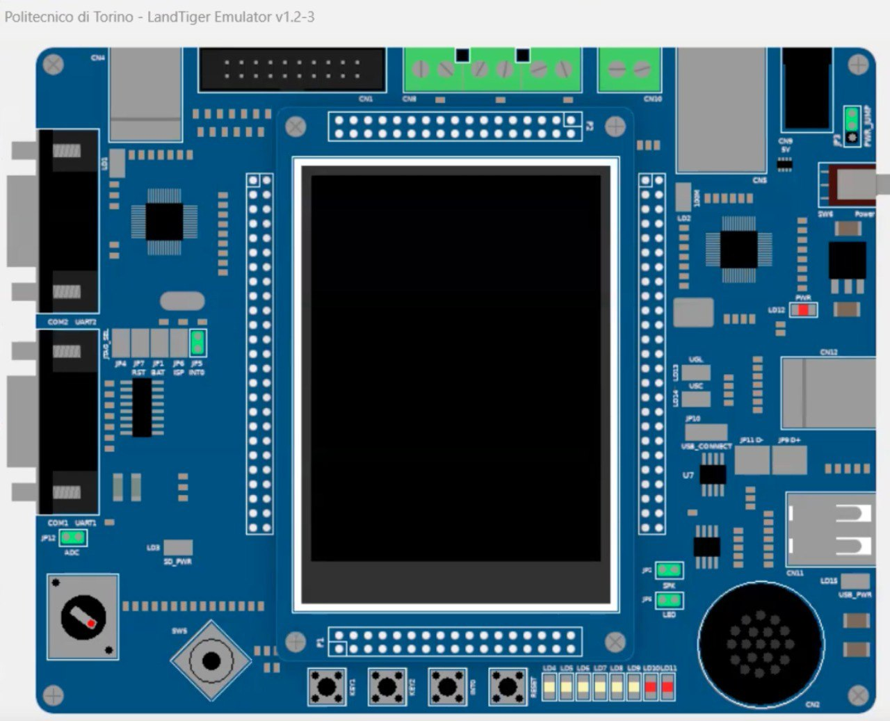

# Tetris - ARM LPC1768 (LandTiger Board)

A classic **Tetris** implementation developed in **C** for the **LPC1768** microcontroller. This project was designed to enhance embedded development skills and acquire full confidence in the usage of the **KEIL IDE** and the **LANDTIGER Board**.



## 📝 Project Overview
This project brings the iconic Tetris gameplay to an embedded system environment. It manages real-time game logic, hardware interrupts, and graphical rendering on the LandTiger's integrated LCD.

* **Platform:** LandTiger Development Board
* **Microcontroller:** ARM Cortex-M3 (LPC1768)
* **Language:** C
* **IDE:** Keil µVision

## 🎯 Objectives
* **KEIL IDE Mastery:** Advanced usage of debugging tools, memory mapping, and project management for ARM architecture.
* **Hardware Integration:** Deep dive into the LPC1768 registers and LandTiger peripherals (LCD, JoyPad/Buttons).
* **Embedded Logic:** Efficiently managing game loops, collision detection, and score tracking in a resource-constrained environment.

## 🚀 Key Features
* **Real-time Block Logic:** Smooth movement and rotation of Tetrominoes.
* **Collision Detection:** Precise boundary and block-to-block interaction.
* **LCD Graphics:** Optimized rendering for the LandTiger display.
* **Input Handling:** Controls implemented via the onboard JoyPad or buttons.

## 🛠️ How to Run
1.  Clone this repository:
    ```bash
    git clone [https://github.com/TorneselloGianluca/Tetris.git](https://github.com/TorneselloGianluca/Tetris.git)
    ```
2.  Open the project file (`.uvprojx`) in **Keil µVision**.
3.  Build the project (F7).
4.  Connect your **LandTiger Board** via USB/J-Link or use the emualator. 
5.  Flash the code (F8) and play!

There is also a video mp4 with a demo of the application in the folder.

Contact me for more info 
gianluca.tornesello2001@gmail.com

---
*Developed as part of an Embedded Systems learning path.*
